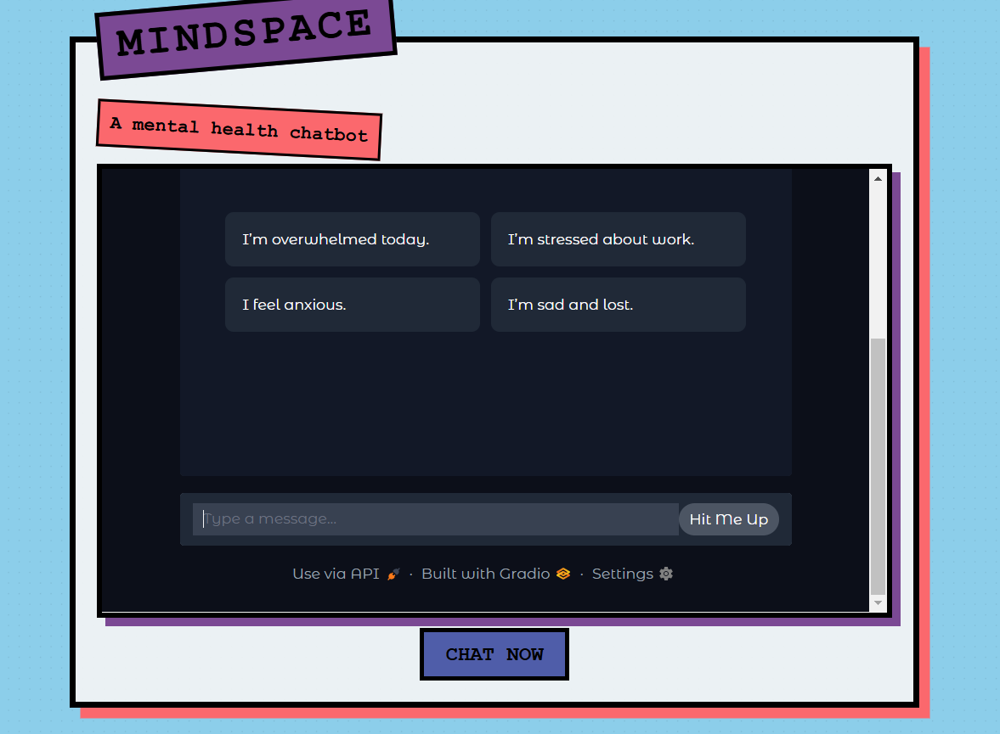

# Mental-Health-Chatbot
This chatbot will offer empathetic support, coping strategies, mindfulness tips, and supportive guidance. Experimented with NVIDIA’s Llama-3.1-Nemotron-70B-Instruct-HF. distilgpt2, and facebook's opt-350m. Intending to experiment with Grok. 
I learned that the opt-350m free model does not really provide the most natural answers and guided responses can throw off its natural response flow easily.

## Features
- Professional, warm responses tailored to mental well-being.
- Powered by Hugging Face’s Inference API and deployed on Spaces.

## Tech Stack
- Python, Transformers, Gradio, Hugging Face Hub
- Model: opt-350m currently, soon to be X AI

## Setup
1. Clone: `git clone https://github.com/yourusername/mindspace-companion.git`
2. Install: `pip install -r requirements.txt`
3. Set `HF_TOKEN` environment variable
4. Run: `python app.py`

## Demo
